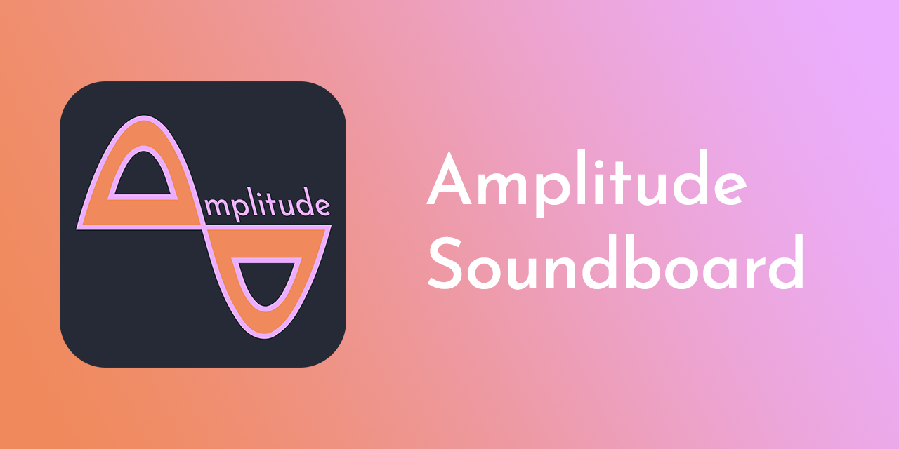

# Amplitude Soundboard

<!-- ALL-CONTRIBUTORS-BADGE:START - Do not remove or modify this section -->

<!-- ALL-CONTRIBUTORS-BADGE:END -->

# [Website](https://amplitude-soundboard.dan0v.com/index.html)

## Features
- Cross-platform availability: Windows, Linux, and MacOS
- Play audio files from many formats
  |  |  |
  | - | - |
  | AAC | AIFF |
  | ALAC | FLAC |
  | M4A | MP3 |
  | MP4 | OGG |
  | OPUS | WAV |

- Customize a grid view of your sound clips to your liking
- Trigger sound clips with custom hotkeys or a button press
- Set output device and volume at a per-clip level
- Toggle between light and dark theme
- Automatically update to the newest version if desired
- Localized versions available ([work in progress](https://github.com/dan0v/AmplitudeSoundboard/issues/7))
  |  |  |  |
  | - | - | - |
  | English | Español | Italiano |
  | Magyar | Nederlands | Polski |
  | Pусский |  |  |

## Installation
### Windows *(x64)*
1. Download and unzip [latest Windows build](https://git.dan0v.com/AmplitudeSoundboard/releases/latest/download/Amplitude_Soundboard_win_x86_64.zip) from the [Releases page](https://git.dan0v.com/AmplitudeSoundboard/releases/).
2. Run executable (`amplitude_soundboard.exe`).
3. If you would like to play sound through an input device like a microphone, set up a program like [Virtual Audio Cable](https://vac.muzychenko.net/en/download.htm) and set the newly created virtual cable as your clip output device.

### MacOS *(x64)*
1. Download and unzip [latest MacOS build](https://github.com/dan0v/AmplitudeSoundboard/releases/latest/download/Amplitude_Soundboard_macOS_x86_64.tar.gz) from the [Releases page](https://git.dan0v.com/AmplitudeSoundboard/releases/).
2. Run executable (`Amplitude Soundboard.app`).
 - If a security warning blocks the app from running, open `System Preferences -> Privacy & Security -> General` and click `Open Anyway`. This is due to not signing the app with an Apple Developer ID.
 - In order to use hotkeys, Amplitude Soundboard must be given accessibility permission to control your computer. This can be done under `System Preferences -> Privacy & Security -> Accessibility`. A popup should take you directly to this option at application startup. Amplitude Soundboard will need to be restarted after granting permissions for hotkeys to start working.
3. If you would like to play sound through an input device like a microphone, set up a program like [BlackHole](https://github.com/ExistentialAudio/BlackHole) and set the newly created virtual cable as your clip output device.

### Linux *(x64)*
1. Download and unzip [latest Linux build](https://github.com/dan0v/AmplitudeSoundboard/releases/latest/download/Amplitude_Soundboard-x86_64.AppImage) from the [Releases page](https://git.dan0v.com/AmplitudeSoundboard/releases/).
2. Run executable (`Amplitude_Soundboard-x86_64.AppImage`).
 - Hotkeys will currently only work under x11, not Wayland, as supported by [SharpHook](https://github.com/TolikPylypchuk/SharpHook).
3. If you would like to play sound through an input device like a microphone, [set up a sink in PulseAudio](https://www.onetransistor.eu/2017/10/virtual-audio-cable-in-linux-ubuntu.html) and set the monitor output of it to your desired input device.

## Updates
### Windows
A dialog automatically notifies users of available updates at application startup. To automatically update, click `Update`, or, to manually update, just download the [latest Windows build](https://git.dan0v.com/AmplitudeSoundboard/releases/latest/download/Amplitude_Soundboard_win_x86_64.zip) from the [Releases page](https://git.dan0v.com/AmplitudeSoundboard/releases/) and replace your `amplitude_soundboard.exe` with the new version.

### MacOS
A dialog automatically notifies users of available updates at application startup. To manually update, just download the [latest MacOS build](https://github.com/dan0v/AmplitudeSoundboard/releases/latest/download/Amplitude_Soundboard_macOS_x86_64.tar.gz) from the [Releases page](https://git.dan0v.com/AmplitudeSoundboard/releases/) and replace your `Amplitude Soundboard.app` with the new version.

### Linux
A dialog automatically notifies users of available updates at application startup. To manually update, just download the [latest Linux build](https://github.com/dan0v/AmplitudeSoundboard/releases/latest/download/Amplitude_Soundboard-x86_64.AppImage) from the [Releases page](https://git.dan0v.com/AmplitudeSoundboard/releases/) and replace your `Amplitude_Soundboard-x86_64.AppImage` with the new version.

## Screenshots
Main grid|Soundclip list
-|-
 | 

Editing a soundclip|Global settings
-|-
|

## Contributors

Many thanks to all these people! ([emoji key](https://allcontributors.org/docs/en/emoji-key)):

<!-- ALL-CONTRIBUTORS-LIST:START - Do not remove or modify this section -->
<!-- prettier-ignore-start -->
<!-- markdownlint-disable -->
<table>
  <tbody>
    <tr>
      <td align="center" valign="top" width="14.28%"><a href="https://github.com/dan0v"> <b>dan0v</b></a> <a href="https://github.com/dan0v/AmplitudeSoundboard/commits?author=dan0v" title="Code">💻</a> <a href="https://github.com/dan0v/AmplitudeSoundboard/issues?q=author%3Adan0v" title="Bug reports">🐛</a> <a href="#design-dan0v" title="Design">🎨</a> <a href="https://github.com/dan0v/AmplitudeSoundboard/commits?author=dan0v" title="Documentation">📖</a> <a href="#maintenance-dan0v" title="Maintenance">🚧</a> <a href="#platform-dan0v" title="Packaging/porting to new platform">📦</a> <a href="https://github.com/dan0v/AmplitudeSoundboard/pulls?q=is%3Apr+reviewed-by%3Adan0v" title="Reviewed Pull Requests">👀</a> <a href="#userTesting-dan0v" title="User Testing">📓</a></td>
      <td align="center" valign="top" width="14.28%"><a href="https://github.com/Taylor-Cozy"> <b>Taylor Hetherington</b></a> <a href="https://github.com/dan0v/AmplitudeSoundboard/commits?author=Taylor-Cozy" title="Code">💻</a> <a href="#userTesting-Taylor-Cozy" title="User Testing">📓</a> <a href="https://github.com/dan0v/AmplitudeSoundboard/commits?author=Taylor-Cozy" title="Documentation">📖</a> <a href="#design-Taylor-Cozy" title="Design">🎨</a></td>
      <td align="center" valign="top" width="14.28%"><a href="https://github.com/John-Cozy"> <b>John</b></a> <a href="https://github.com/dan0v/AmplitudeSoundboard/commits?author=John-Cozy" title="Code">💻</a> <a href="#userTesting-John-Cozy" title="User Testing">📓</a> <a href="https://github.com/dan0v/AmplitudeSoundboard/commits?author=John-Cozy" title="Documentation">📖</a> <a href="#design-John-Cozy" title="Design">🎨</a></td>
      <td align="center" valign="top" width="14.28%"><a href="https://github.com/scottajevans"> <b>scottajevans</b></a> <a href="#translation-scottajevans" title="Translation">🌍</a></td>
      <td align="center" valign="top" width="14.28%"><a href="https://github.com/SonjaVredeveld"> <b>SVredeveld</b></a> <a href="#translation-SonjaVredeveld" title="Translation">🌍</a></td>
      <td align="center" valign="top" width="14.28%"><a href="https://github.com/GF1977"> <b>Ilia Opiakin</b></a> <a href="#translation-GF1977" title="Translation">🌍</a></td>
      <td align="center" valign="top" width="14.28%"><a href="https://github.com/AntoSkate"> <b>Antonio Brugnolo</b></a> <a href="#translation-AntoSkate" title="Translation">🌍</a></td>
    </tr>
    <tr>
      <td align="center" valign="top" width="14.28%"><a href="https://ktos.info"> <b>Marcin Badurowicz</b></a> <a href="#translation-ktos" title="Translation">🌍</a> <a href="https://github.com/dan0v/AmplitudeSoundboard/commits?author=ktos" title="Code">💻</a></td>
      <td align="center" valign="top" width="14.28%"><a href="https://github.com/Swell61"> <b>Samuel</b></a> <a href="#userTesting-swell61" title="User Testing">📓</a></td>
      <td align="center" valign="top" width="14.28%"><a href="https://github.com/teacup775"> <b>teacup775</b></a> <a href="https://github.com/dan0v/AmplitudeSoundboard/issues?q=author%3Ateacup775" title="Bug reports">🐛</a></td>
      <td align="center" valign="top" width="14.28%"><a href="https://chapien.net/"> <b>Chapien</b></a> <a href="https://github.com/dan0v/AmplitudeSoundboard/issues?q=author%3AChapien" title="Bug reports">🐛</a></td>
      <td align="center" valign="top" width="14.28%"><a href="https://github.com/deadnamedimmer"> <b>Dimmer</b></a> <a href="https://github.com/dan0v/AmplitudeSoundboard/commits?author=deadnamedimmer" title="Code">💻</a></td>
      <td align="center" valign="top" width="14.28%"><a href="https://jew.pizza/"> <b>David Cooper</b></a> <a href="#platform-dtcooper" title="Packaging/porting to new platform">📦</a></td>
    </tr>
  </tbody>
</table>

<!-- markdownlint-restore -->
<!-- prettier-ignore-end -->

<!-- ALL-CONTRIBUTORS-LIST:END -->

This project follows the [all-contributors](https://github.com/all-contributors/all-contributors) specification. Contributions of any kind welcome!
